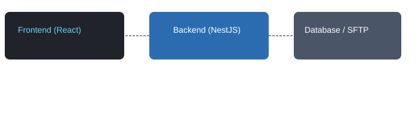

# Famex

  

A full-stack personnel and expense management prototype. The backend is built with NestJS (TypeScript) and the frontend is a React single-page application.

## Overview
- **Backend:** NestJS (TypeScript)
- **Frontend:** React
- **Purpose:** Employee management, expense tracking, JWT-based authentication, and SFTP integration for file storage.

## Features
- 🧑‍💼 **Employee Management:** create, update, delete and list employees with validation and response DTOs.
- 🧾 **Expense Tracking:** create, update, list, and query expenses with pagination support.
- 🔐 **Authentication:** JWT-based login and route guards; token handling in `auth` module.
- ⚙️ **SFTP Integration & Utilities:** upload/download helpers and encryption utilities in `utils`.
- 📦 **Pagination:** common DTOs for pagination requests and responses.
- 🧪 **Tests:** backend unit/e2e tests scaffolded under `backend/test`.



## Project Structure
- `backend/` — REST API server (NestJS, TypeScript). See `backend/src` for modules and controllers.
- `frontend/` — React client app. See `frontend/src` for components and pages.

### Notable backend modules
- `auth` — authentication controllers, JWT strategy, guards, and DTOs.
- `employee` — endpoints and services for employee CRUD.
- `expense` — endpoints and services for expense management.
- `utils` — `encryption.service.ts`, `sftp.service.ts` and helpers.

## Technologies
- Node.js, npm
- NestJS (TypeScript)
- React
- Database (configured in `backend/config/database.config.ts` — MySQL/Postgres)

## Requirements
- Node.js (LTS / v16+ recommended)
- npm or yarn
- A relational database (MySQL or Postgres)

## Example Environment Variables
Create a `.env` file in `backend/` with at least:

```
DB_HOST=localhost
DB_PORT=3306
DB_USER=root
DB_PASS=your_password
DB_NAME=famex
JWT_SECRET=your_jwt_secret
SFTP_HOST=your_sftp_host
SFTP_USER=your_sftp_user
SFTP_PASS=your_sftp_pass
```

Adjust or extend variables according to `backend/config` and `utils` needs.

## Running Locally

Backend

```bash
cd backend
npm install
npm run start:dev
```

Frontend

```bash
cd frontend
npm install
npm start
```

Open the frontend in a browser and confirm the API endpoints are reachable for the backend port.

## Build & Test
- Backend build: `cd backend && npm run build`
- Backend test: `cd backend && npm run test`
- Frontend build: `cd frontend && npm run build`
- Frontend test: `cd frontend && npm test`

## Deployment Notes
- Provide production environment variables in your hosting/CI.
- Serve the frontend `build` directory from a static host (Netlify, Vercel, S3 + CloudFront, etc.).
- Run the backend on Node.js runtime (PM2, Docker, or cloud provider).

## Contributing
- Open issues or PRs. Follow existing code patterns and include tests where relevant.

## Assets / Icons
- Icons used in this README are in `docs/assets/` (`backend.svg`, `frontend.svg`, `architecture.svg`).

## License
Add a `LICENSE` file if you plan to open source the project (e.g., MIT).

---

This README was generated and can be edited to match your deployment and workflow specifics.
